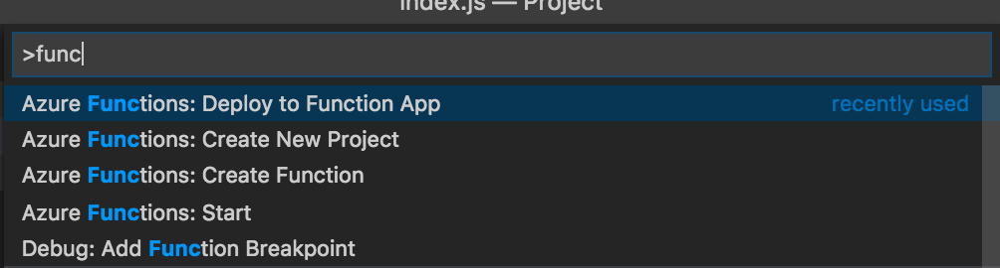

# Azure Functions ハンズオン

2018/03/24 JAZUG福岡(ふくあず) 2018#2 で実施するハンズオンの手順書です。  
イベントページ：https://fukuazu.connpass.com/event/81210/

Azure Functionsの概要については、[こちら](https://docs.microsoft.com/ja-jp/azure/azure-functions/functions-overview)をご覧ください。


## 今回作成するもの

* HTTPリクエストの内容をもとに、以下のアクションを行う
    * HTTPレスポンスを返す
    * メールを送信する
    * Slackへポストする


## 必要なもの

* Microsoft Azureアカウント
    * [無料試用アカウント](https://azure.microsoft.com/ja-jp/free/) (要クレジットカード)
* 開発環境(2018/03時点)
    * Node 8.0+(v8.10.0)
        * [Windows](https://qiita.com/taiponrock/items/9001ae194571feb63a5e)
        * [Mac](https://qiita.com/kyosuke5_20/items/c5f68fc9d89b84c0df09)
    * Azure Core Function Tools 2.0(2.0.1-beta.23-1)
        * `npm install -g azure-functions-core-tools@core`
    * .NET Core 2.0(2.1.4) [Windows](https://www.microsoft.com/net/download/windows/build) | [Mac](https://www.microsoft.com/net/download/macos)
    * [Visual Studio Code(1.21.0)](https://code.visualstudio.com)
    * [Azure Account(0.3.1)](https://marketplace.visualstudio.com/items?itemName=ms-vscode.azure-account) (Visual Studio Code拡張)
    * [Azure Functions(0.7.0)](https://marketplace.visualstudio.com/items?itemName=ms-azuretools.vscode-azurefunctions) (Visual Studio Code拡張)
* SendGridアカウント(ハンズオン時は提供します)
* Slackスペース(ハンズオン時は提供します)


## 用語集

手順中に利用する略称などは以下の通りです。知らない単語が出てきたらここを参照ください。

* VSCode
    * Visual Studio Code


# 事前手順


## VSCodeの拡張機能インストール手順

VSCodeメニューの一番下にある四角いアイコンを選択します。


検索エリアに利用する「Azure Account」や「Azure Functions」を入力し、表示された候補からそれぞれのエクステンションを選択します。


表示されたエクステンション詳細から「Install」を選択してインストールします。


「Reload」ボタンが表示されたら、そちらを選択してVSCodeを再起動したら、拡張機能のインストールは完了です。  
他の拡張機能も便利なものがたくさんありますので、是非活用してください！


# ハンズオン開始！

## Functionsを作成するアカウントでVSCodeにサインイン

諸々の環境を整備したVSCodeにAzureアカウントでサインインします。 コマンドパレットを開き（Shift + Command + P）「azure」と入力し、「Azure: Sign In」を選択します。


URLとcodeが表示されるので、「Copy & Open」を選択します。


ブラウザが開きますので、コピーされたcodeを入力し、アカウントを選択します。


成功するとVSCodeのステータスバーにアカウントが表示されます。


## Functions Appを作成

コマンドパレットを開き「func」と入力し、「Azure Functions: Create New Project」を選択します。


プロジェクトディレクトリを選択すると、言語の選択になるので、「Javascript」を選択します。


## Functionを作成

コマンドパレットを開き「func」と入力し、「Azure Functions: Create Function」を選択します。


プロジェクトのディレクトリを選択します。


プロジェクトのテンプレートを選択します。  
今回は「HTTP trigger with parameters」を選択します。


任意の関数名を設定します。  
ここではデフォルトのまま「HttpTriggerWithParametersJS」と名付けています。


最後に認証レベルを「Function」に設定します。


## デプロイ

作成されたFunctionをデプロイします。  
コマンドパレットを開き「func」と入力し、「Azure Functions: Deploy to Function App」を選択します。



デプロイする対象のディレクトリを選択します。


サブスクリプションを選択します。


まだAzure上にはFunctionAppがないので、新規で作成します。


ここでは「fukuazu-sample」という名前にします。  
注意書きにあるようにこの名前がURLの一部となりますので、一意な名前にする必要があります。


リソースグループを選択します。なければここで作成します。


ここでは「fukuazusample」という名前で新規作成します。


デプロイするロケーションを選択します。


ストレージアカウントを選択します。  
既存のものでもいいですし、新規作成でもOKです。


ここでは「fukuazusample」という名前で新規作成します。


本当にデプロイしてもいいか聞かれますので、「Yes」を選択します。


## テストリクエスト

VSCode内のEXPLORERにある「AZURE FUNCTIONS」拡張から作成したFunctionを右クリックし、FunctionのURLをコピーします。


以下のようなURLになるので、「HttpTriggerWithParametersJS」部分を「HttpTriggerJS/name/hoge」と書き換え、ブラウザでアクセスします。  

```https://<FunctionApp名>.azurewebsites.net/api/HttpTriggerWithParametersJS?code=<リクエストキー>```

```https://<FunctionApp名>.azurewebsites.net/api/HttpTriggerJS/name/hoge?code=<リクエストキー>```


「Hello hoge」とブラウザに表示されれば成功です。


## バージョン2(メール送信対応)への修正

HTTPレスポンスを返すFunctionが出来ましたので、次はメール送信が出来るように変更します。

`HttpTriggerWithParametersJS/function.json` を開き、以下の設定を `bindings` 内に追加します。

```
    {
      "type": "sendGrid",
      "name": "message",
      "apiKey": "SENDGRID_APIKEY",
      "direction": "out"
    }
```

VSCode内の「AZURE FUNCTIONS」拡張にある「Application Settings」を右クリックし、「Add new setting...」を選択します。


Key名を「SENDGRID_APIKEY」、Valueはハンズオン時に公開するものを入力します。


`HttpTriggerWithParametersJS/index.js` を開き、以下のように修正します。  
toのemail部分には受信可能な自分のメールアドレスを入力します。

```
module.exports = function (context, req) {
    context.log('JavaScript HTTP trigger function processed a request.');

    context.bindings.message = {
        personalizations: [
          { to: [ { email: "<受信可能なメールアドレス>" } ] }
        ],
        subject: "[Fukuazu Hands-on] Sample Mail",
        content:[ 
            { 
                type: "text/plain",
                value: "Your name is [" + req.params.name + "]." 
            }
        ],
        from: { email: "azure_f87070529aadda227182b98034bf05f3@azure.com" }
    };

    context.res = {
        // status: 200, /* Defaults to 200 */
        body: "Hello " + req.params.name
    };
    context.done();
};
```


## デプロイ

修正したFunctionをデプロイします。  
コマンドパレットを開き「func」と入力し、「Azure Functions: Deploy to Function App」を選択し、先程と同様にデプロイを行います。


## リクエスト

先程リクエストしたように、今度は `hoge` を `hoge2` としてリクエストします。

```https://<FunctionApp名>.azurewebsites.net/api/HttpTriggerJS/name/hoge2?code=<リクエストキー>```

しばらくすると宛先として設定したメールアドレスへメールが届きます。


## バージョン3(Slack対応)への修正

FunctionsからSendGridを経由してメール送信が出来るようになりました。  
今度はSlackへメッセージをポストしてみます。

SlackのIncoming Webhookを利用するため、FunctionsからHTTPリクエストを行う必要があります。  
今回は、NodeJSでHTTPリクエストが行えるsuperagentを利用します。

ターミナルで `HttpTriggerWithParametersJS` ディレクトリへ移動します。

`npm init` を実行し、 `package.json` を作成します。

```
$ npm init
This utility will walk you through creating a package.json file.
It only covers the most common items, and tries to guess sensible defaults.

See `npm help json` for definitive documentation on these fields
and exactly what they do.

Use `npm install <pkg>` afterwards to install a package and
save it as a dependency in the package.json file.

Press ^C at any time to quit.
package name: (httptriggerwithparametersjs)
version: (1.0.0)
description:
entry point: (index.js)
test command:
git repository:
keywords:
author:
license: (ISC)
About to write to /path/to/Project/HttpTriggerWithParametersJS/package.json:

{
  "name": "httptriggerwithparametersjs",
  "version": "1.0.0",
  "description": "",
  "main": "index.js",
  "scripts": {
    "test": "echo \"Error: no test specified\" && exit 1"
  },
  "author": "",
  "license": "ISC"
}


Is this ok? (yes) yes
```

作成された `package.json` に以下の通りsuperagentの記述を追加します。

```
  "dependencies": {
    "superagent": "^3.8.1"
  }
```

再度、ターミナルに戻り `npm install` を実行します。

```
$ npm install
npm notice created a lockfile as package-lock.json. You should commit this file.
npm WARN httptriggerwithparametersjs@1.0.0 No description
npm WARN httptriggerwithparametersjs@1.0.0 No repository field.

added 24 packages in 3.589s
```

これで、superagentを利用する準備が出来ました。

`HttpTriggerWithParametersJS/index.js` を開き、以下のように修正します。  

```
var request = require('superagent');

module.exports = function (context, req) {
    context.log('JavaScript HTTP trigger function processed a request.');

    request
    .post("<Slackポスト用URL>")
    .set('Content-Type', 'application/json')
    .send({text: "Your name is [" + req.params.name + "]."})
    .end(function(res){
        context.log(res.message);

        context.bindings.message = {
            personalizations: [
              { to: [ { email: "<受信可能なメールアドレス>" } ] }
            ],
            subject: "[Fukuazu Hands-on] Sample Mail",
            content:[ 
                { 
                    type: "text/plain",
                    value: "Your name is [" + req.params.name + "]." 
                }
            ],
            from: { email: "azure_f87070529aadda227182b98034bf05f3@azure.com" }
        };
    
        context.res = {
            // status: 200, /* Defaults to 200 */
            body: "Hello " + req.params.name
        };
        context.done();    
    });
};
```

## デプロイ

修正したFunctionをデプロイします。  
コマンドパレットを開き「func」と入力し、「Azure Functions: Deploy to Function App」を選択し、先程と同様にデプロイを行います。


## リクエスト

先程リクエストしたように、今度は `hoge2` を `hoge3` としてリクエストします。

```https://<FunctionApp名>.azurewebsites.net/api/HttpTriggerJS/name/hoge3?code=<リクエストキー>```

Slackへメッセージが届きます。


